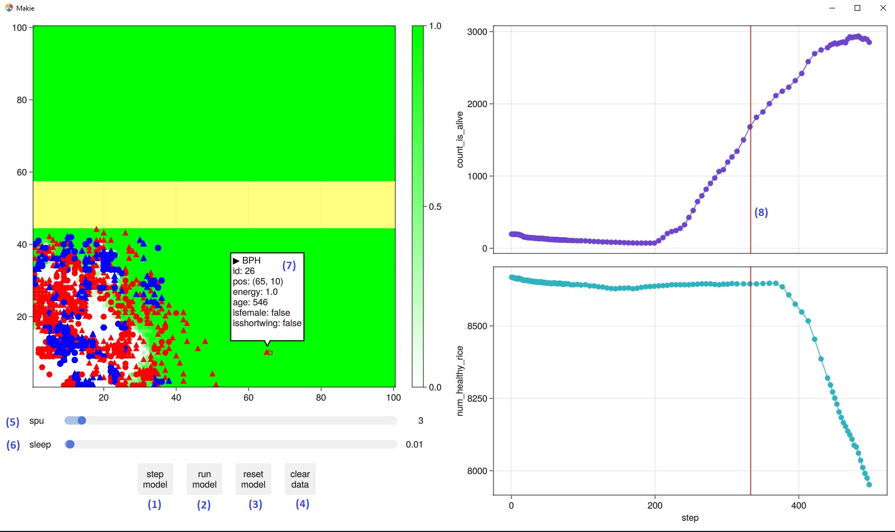

# Rice-BPH Model

This is a model to simulate the rice-brown plant hopper dynamic.
The goal of this model is to research the effect of cultivated flower on the spread inside rice fields of brown plant hopper (a dangerous rice pest).

## Quick start

Clone this repo:
```bash
git clone https://github.com/ndgnuh/RiceBPH
```

At the root directory, run:

```shell
julia scripts/run_explore.jl
```

The first time will take a while to install dependencies. If you have a system image with `Makie`, `GLMakie`, `InteractiveDynamics` and `Agents` precompiled, it will take significantly less time to startup the exploration.
```shell
julia -J sys.so scripts/run_explore.jl
```

## Interface explanation:

- (1) : Run model for one update
- (2) : Start/stop run model
- (3) : Reset model to step 0 
- (4) : Clear all data on the graph
- (5) : Number of model steps per update (Default = 1 step)
- (6) : Time interval between updates (Default = 1 second)
- (7) : Information about individuals in a coordinate
- (8) : Last step of previous runs

